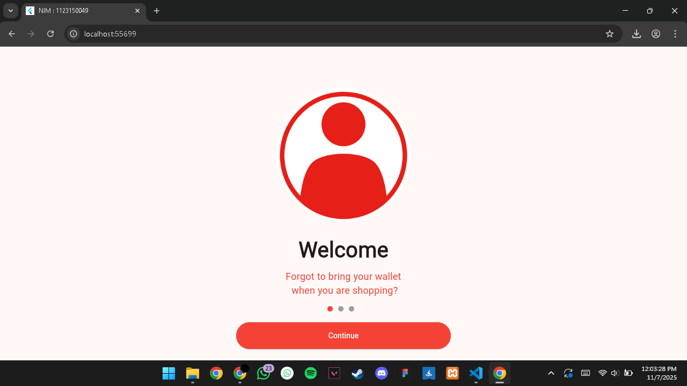
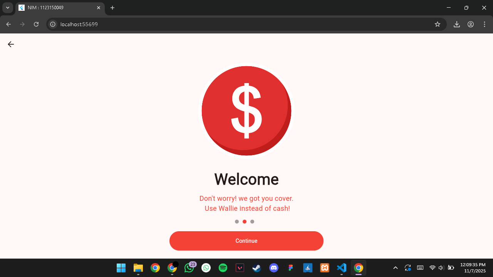
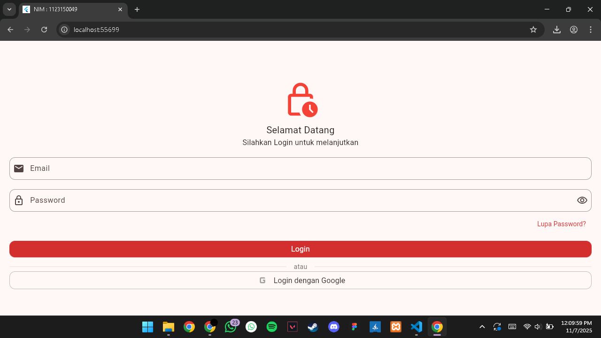

# UTS Pemrogramman Mobile - KB1179

Repository ini berisi project Flutter untuk Ujian Tengah Semester (UTS) mata kuliah **Pemrogramman Mobile**.

## 👤 Identitas Mahasiswa
| Keterangan | Data |
|-----------|------|
| **Nama**  | Dzikri Abdurrahman Haris |
| **NIM**   | 1123150049 |
| **Kelas** | TI SE 23 P1 |
| **Mata Kuliah** | Pemrogramman Mobile |
| **Dosen Pengampu** | I Ketut Gunawan |
| **Tahun Akademik** | 2025 / 2026 |

---

## 📸 Tampilan Aplikasi (Screenshot)
|  
|  
|  
|  |

---

